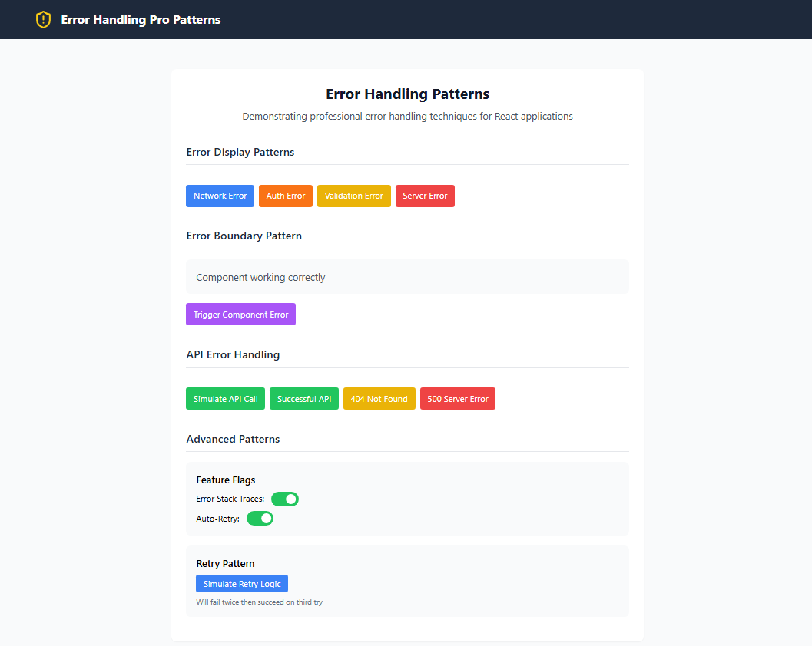

# Enterprise Error Handling Patterns

A production-ready implementation of advanced error handling patterns for React applications. This project demonstrates professional error management techniques used by senior developers to build robust, maintainable applications.

## 🖍️View Sample UI

###

<div align="center">
  
  
  <!-- <iframe style="border: 1px solid rgba(0, 0, 0, 0.1);" width="800" height="450" src="https://embed.figma.com/design//yVLJLnreOFixR5EbOIt2zH/Design-System?node-id=2402-4625&embed-host=share" allowfullscreen></iframe> -->
</div>

###

## Key Features

- 🛡️ **Centralized Error Management**
  - Type-safe error processing
  - Consistent error formatting
  - Automatic error classification
  - Severity-based handling

- 🎯 **Custom Error Classes**
  - Network errors
  - Authentication/Authorization errors
  - Validation errors
  - API/Server errors
  - Rate limiting errors

- 🔄 **Error Boundaries**
  - Component-level error catching
  - Fallback UI rendering
  - Automatic error reporting
  - Reset capabilities

- 🌐 **Global Error Handling**
  - Window error capture
  - Unhandled promise rejection handling
  - Automatic error logging
  - Toast notifications

- 🎛️ **Feature Flags**
  - Runtime error handling configuration
  - Environment-based settings
  - A/B testing support
  - Gradual rollout capabilities

## Quick Start

```bash
# Install dependencies
npm install

# Start development server
npm run dev
```

## Advanced Usage

### Custom Error Classes

```typescript
// Create a specialized error
const validationError = new ValidationError(
  'Form validation failed',
  {
    email: ['Invalid email format'],
    password: ['Must be at least 8 characters']
  }
);

// Error includes built-in user message formatting
console.log(validationError.getUserMessage());
```

### Error Boundary Implementation

```tsx
// Wrap components that might throw errors
<ErrorBoundary
  fallback={(error) => (
    <div className="error-ui">
      <h2>Something went wrong</h2>
      <p>{error.message}</p>
      <button onClick={reset}>Try Again</button>
    </div>
  )}
  onError={(error) => logErrorToMonitoring(error)}
>
  <YourComponent />
</ErrorBoundary>
```

### API Error Handling

```typescript
// Use the error-aware API hook
const { execute, loading, error } = useApi<UserData>();

// Make API calls with built-in error handling
const fetchUser = async (id: string) => {
  const result = await execute(`/api/users/${id}`);
  
  if (result.error) {
    // Error is already processed and typed
    console.log(result.error.category); // e.g., "network" | "validation" | etc.
    return;
  }
  
  // Success case
  const userData = result.data;
};
```

### Retry Pattern with Backoff

```typescript
const result = await retryWithBackoff(
  async () => {
    // Your async operation here
    return await api.fetchData();
  },
  {
    maxRetries: 3,
    initialDelayMs: 1000,
    backoffFactor: 2,
    shouldRetry: (error) => error instanceof NetworkError
  }
);
```

### Feature Flags

```typescript
// Check if a feature is enabled
if (isFeatureEnabled('ENABLE_ERROR_STACK_TRACES')) {
  console.log(error.stack);
}

// Conditional execution based on feature flag
withFeatureFlag(
  'ENABLE_AUTOMATIC_RETRY',
  () => retryFailedOperation(),
  () => handleFailureImmediately()
);
```

### Error Middleware

```typescript
const apiCall = withErrorHandling(
  async (id: string) => {
    const response = await fetch(`/api/data/${id}`);
    if (!response.ok) throw new Error('API call failed');
    return response.json();
  },
  {
    context: 'DataService.fetch',
    shouldReport: (error) => error.severity === ErrorSeverity.HIGH
  }
);
```

## Error Categories

The system supports various error categories, each with specific handling:

- `NetworkError`: Connection and timeout issues
- `AuthenticationError`: Login and session problems
- `AuthorizationError`: Permission-related issues
- `ValidationError`: Input validation failures
- `ServerError`: Backend system errors
- `RateLimitError`: API rate limiting
- `NotFoundError`: Resource not found cases

## Best Practices

1. **Always Use Error Boundaries**
   - Place them strategically in your component tree
   - Provide meaningful fallback UIs
   - Include retry mechanisms where appropriate

2. **Consistent Error Processing**
   - Process all errors through `ErrorManager`
   - Maintain type safety throughout the error chain
   - Use appropriate error categories

3. **User-Friendly Error Messages**
   - Implement `getUserMessage()` for all custom errors
   - Provide clear, actionable error messages
   - Include retry options when applicable

4. **Monitoring Integration**
   - Log important errors to monitoring service
   - Include relevant context with errors
   - Track error patterns and frequencies

5. **Feature Flag Usage**
   - Control error handling behavior with flags
   - Use flags for gradual rollout of new error handling
   - Enable/disable features based on environment

## Contributing

1. Fork the repository
2. Create your feature branch (`git checkout -b feature/amazing-error-handling`)
3. Commit your changes (`git commit -m 'Add some amazing error handling'`)
4. Push to the branch (`git push origin feature/amazing-error-handling`)
5. Open a Pull Request

## License

MIT License - MIT — feel free to fork and customize!